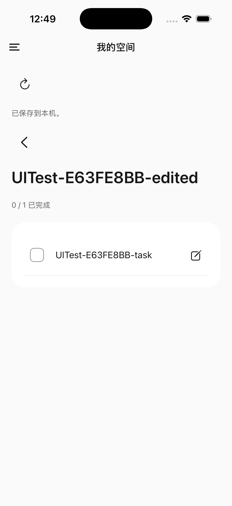
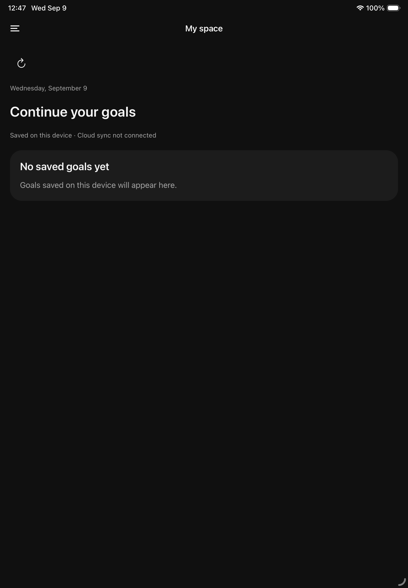

# 个人空间本地切片实施证据

日期：2026-09-09。Target release: 0.0.1。关联变更：[add-account-family-spaces](../../../openspec/changes/add-account-family-spaces/tasks.md)，space-experience 的已有目标查看与任务编辑部分。状态：已实施、代表模拟器验证；完整UI与功能验收未完成。

维护者已明确“很好，Figma 验收通过，可以继续推进。”本轮进入正式移动应用实施，未购买、部署、提交或推送。

## 行为与文件

- `apps/mobile/app/(shell)/space.tsx`、`_layout.tsx`：新增“我的空间 / My space”路由入口，保留聊天默认入口。
- `apps/mobile/src/screens/personal-space-screen.tsx`：读取已有SQLite目标与任务；完成、取消完成及改名调用现有版本化命令处理器，成功后重新查询正式记录。界面明确为本机保存、未连接云同步。
- `apps/mobile/src/space/goal-progress.ts`：通过同空间Goal→Project→Task关系计算进度，排除归档及未关联任务；编辑对象消失或版本变化时保留输入，禁止静默覆盖。
- `apps/mobile/src/i18n/messages.ts`、`src/ui/theme.ts`：补充中英语言资源和蓝灰焦点卡明暗语义色，复用现有图标。
- `apps/mobile/tests/goal-progress.test.mjs`：8项关系过滤与编辑恢复测试。

已读取Figma文件`5OKY7OMJ2jQy2XAaGbNDGC`的首页`221:1500`及目标页`221:1554`设计上下文。复用现有React Native组件与导航，尚未宣称全部画面一比一实现。

## 执行与结果

工作目录 `/Users/feature/code/siyue`；Node 22.22.3，pnpm 11.25.0。

| 命令/检查 | 实际结果 |
| --- | --- |
| `corepack pnpm --filter @siyue/mobile typecheck` | 通过；最初缺少新路由生成类型，正常启动Expo生成后通过，未弱化类型检查 |
| `corepack pnpm --filter @siyue/mobile test` | 73/73通过，0跳过 |
| `corepack pnpm bundle:mobile` | iOS/Android Hermes导出通过；不等于原生构建或真机验收 |
| `corepack pnpm spec:check` | 4项通过 |
| `corepack pnpm release:check` | 通过；版本未发布 |
| `git diff --check` | 通过 |
| 独立只读复审 | 原编辑版本冲突与对象消失问题已修复；未发现仍需立即修复的确定性严重问题 |

## 模拟器观察

通过 `corepack pnpm --filter @siyue/mobile exec expo start --localhost --port 8081` 向既有开发客户端提供当前代码；`xcrun simctl openurl <device> siyue://space`进入正式路由，通过Simulator界面实际点击。

- iPhone：Siyue M1 QA，`7328BC59-6853-445B-A888-E99496AB2048`，iOS26.5。已有合成QA目标中的任务从0/1勾选到1/1；终止并重新启动应用后仍为1/1。随后恢复0/1。改名为带`-space-review`后缀的名称并保存，正式列表显示修改；再恢复原名称。仅使用既有合成QA记录，版本随操作自然递增。
- iPad：Siyue UI Audit iPad，`9F1E3F2F-B074-498C-A87C-8F46A0E2BF5D`，iOS26.5。当前本地无目标，英文暗色空状态已查看；未植入示例数据，未验证有数据双栏。

## 未运行和剩余范围

未完成：目标创建及AI草稿确认入口、独立任务呈现、正式账号与家庭共享、云同步、Electron对应页面、完整中英明暗/iPhone/iPad横竖屏/大字体/键盘矩阵、原生冲突故障注入、Android运行与所有真机验收。空状态尚无创建入口。iPad目前采用宽屏内容分栏条件，完整Figma侧栏仍待实现。2026-09-09复核：现有原生 Info.plist 的 iPad 专用方向键已包含四方向，不能将其记作配置未实现；完整横屏布局与交互矩阵仍待验收。

现有命令处理器负责版本及回执；本轮未修改协议、schema或云端权限。不能以73项单元测试或代表截图替代真实云协作、安全边界及全部UI验收。
