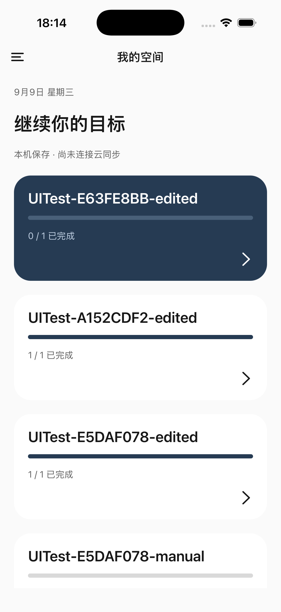
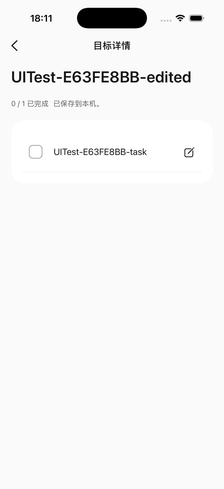
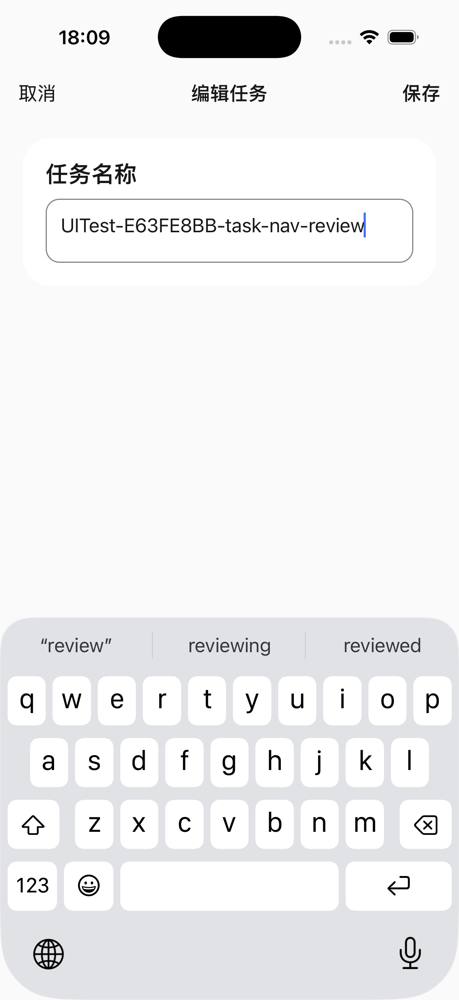

# 个人空间导航纠正

2026-09-09，版本0.0.1；沿用add-account-family-spaces活动变更，本轮为维护者明确要求的局部导航纠正，不新增功能范围。UI验收按M级，关注UI-V01/02/05/10与UI-I02/03/04。

## 已修改

`apps/mobile/src/screens/personal-space-screen.tsx`统一使用原生顶栏：首页菜单、详情返回、编辑取消与保存。详情/编辑关闭抽屉侧滑。正文移除独立刷新和返回行，普通刷新改为下拉，错误时保留就近重试。编辑不再混排原详情，最大宽度640；未修改禁用保存、直接取消，修改后取消需确认。Android返回处理按编辑→详情→首页退层。保存反馈放在进度同行并允许换行，不再在标题前插入一行。

`apps/mobile/src/i18n/messages.ts`补充中英详情/编辑标题和短保存文案。

## 实际验证

工作目录`/Users/feature/code/siyue`，Node22.22.3/pnpm11.25.0。移动typecheck通过；移动测试73/73通过。独立只读复审发现提示行换行和写入误显示下拉刷新两处问题，均已修正。

iPhone模拟器Siyue M1 QA（iOS26.5）：实际点击首页→详情→编辑，AX与截图确认只有一层导航，详情没有菜单、正文返回或常驻刷新；编辑只有取消/保存，无原详情。未修改取消直接返回；修改后取消显示保护提示，继续编辑保留输入。实际打开软键盘，顶栏保存可达，点击保存后返回原详情且键盘收起；已恢复合成QA任务原名称`UITest-E63FE8BB-task`。详情返回首页恢复菜单。

iPad模拟器Siyue UI Audit iPad（iOS26.5）：英文暗色空首页已查看，无多余刷新行。尚未验证有数据详情/编辑、横屏和大字号；不以空首页替代这些场景。

## 限制

尚未真机、Android返回运行验证、全双语明暗矩阵、iPad有数据编辑及横屏验收。当前仍为单路由内部视图切换，未实现iOS原生Stack侧滑返回手势；顶栏返回可用。未调用AI模型，未改账号/云同步，无提交、推送、部署。此次截图只证明列出的状态与操作，不代表整体UI验收。
